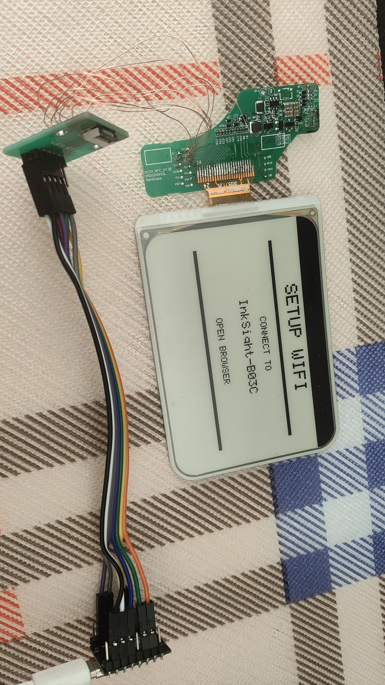
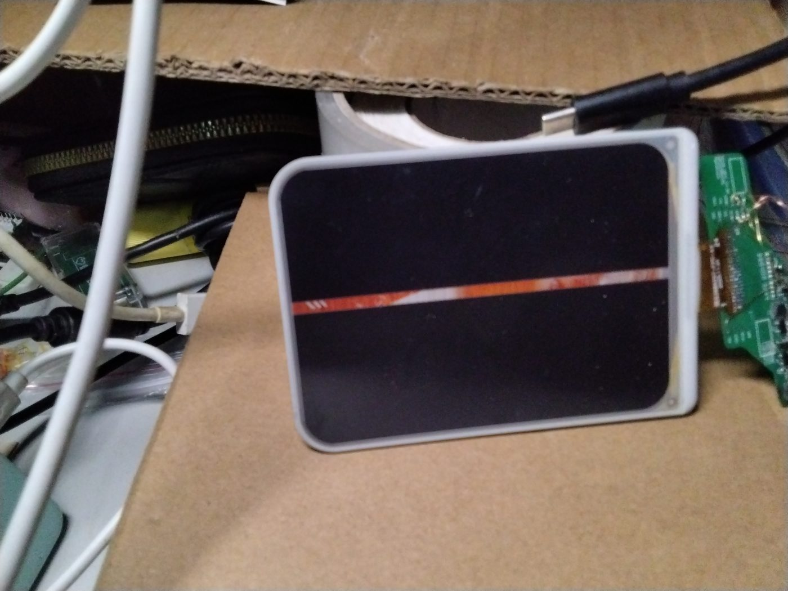
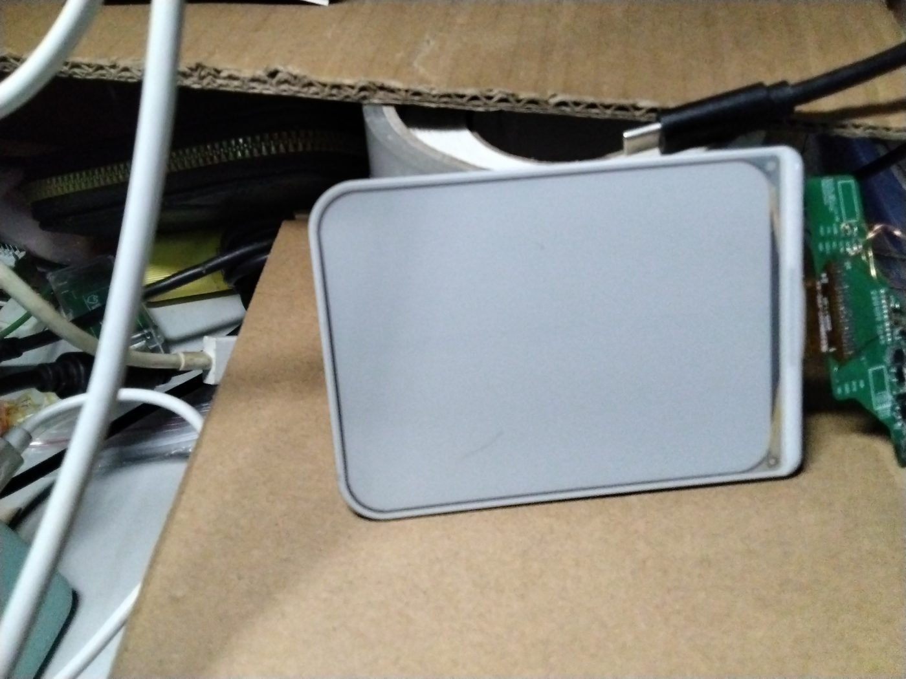
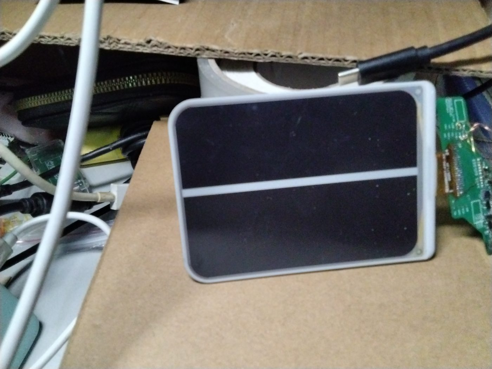

# 🐟 InkSight 墨水屏 · A1.1 屏幕适配版

> **一句话说明：让 InkSight（墨鱼）华为手机壳墨水屏项目支持 A1.1 版 3.98 寸四色墨水屏，修掉屏幕正中间那条怎么刷都擦不掉的橙色横线。**

如果你手上的墨水屏是 **A1.1 版**，刷上原来的 A1 固件后屏幕中间会有条橙线 —— 这个仓库就是来解决这个问题的，并且已经 **在真机上验证通过**。



*上图为 A1.1 屏幕刷入本固件后的实拍：正常显示 `SETUP WIFI / CONNECT TO InkSight-B03C` 配网引导界面，**中间没有橙线**。*

---

## 📖 这是个什么项目

**InkSight（墨鱼）** 是一个开源墨水屏项目：一块 3.98 寸四色墨水屏 + ESP32，做成华为手机壳大小的桌面小摆件，可以通过网页刷机、配置、推送天气/日历/待办等各种「模式」。

- 🌐 原项目官网：<https://www.inksight.site/>
- 📦 原项目仓库：[`datascale-ai/inksight`](https://github.com/datascale-ai/inksight)（原作 / 墨鱼）
- 📦 本仓库上游：[`krstc/InkSight_adapt_HUAWEI_eink`](https://github.com/krstc/InkSight_adapt_HUAWEI_eink)（把墨鱼适配到**华为手机壳 A1**）

原上游作者在 README 里写了「A0 和 A1.1 版本后续将继续适配」—— **本仓库就是来补上 A1.1 这一块的**。

> 本仓库是在 `krstc` 的适配版基础上，**只改屏幕驱动**，让它能直接驱动 A1.1 屏幕。其余代码、引脚、开发板全部保持原样，方便大家直接复刻。

---

## 🩹 A1.1 屏幕的问题：中间一条橙线

A1.1 和 A1 用的是**同一颗驱动 IC（JD79665）**、**同样 768×552 的四色面板**，但用 A1 的驱动参数去刷，屏幕**正中间会出现一条橙色横线**，刷黑、刷白、刷彩色都在，深清也清不掉。

排查过程（详见 [issue #1](https://github.com/krstc/InkSight_adapt_HUAWEI_eink/issues/1)）：

| 步骤 | 现象 |
|---|---|
| ① 用 A1 原版代码刷黑 | ❌ 中间仍有一条橙线 |
| ② 把分辨率改成 800×600 后刷白 | ✅ 能驱动到更多栅极，颜色正常 |
| ③ 再换回 A1 原版参数刷黑 | ❌ 橙线又回来了 |

三张实拍图（来自 issue）：

| ① A1 原版代码刷黑：有橙线 | ② 分辨率改 800×600 刷白 | ③ 换回 A1 参数刷黑：橙线仍在 |
|---|---|---|
|  |  |  |

**结论**：这不是屏幕坏了，而是**控制器驱动分辨率设置不对，漏驱动了正中间的一行栅极**。

---

## 🔧 修复原理

核心只有一句话：

> **让控制器按 `768×600` 驱动，而不是面板的 `768×552`。**

当 `0x61`（TRES 分辨率）设成 **768×552** 时，控制器会漏驱动正中间那一行栅极（表现为橙线）；把它设成 **768×600**（行数 600 大于面板的 552），所有栅极就都被驱动到了，**橙线消失**。

图像数据仍然按面板真实尺寸 **768×552** 放在左上角，控制器多出来的那部分（下方 48 行）**填白**，位于可见区域之外，不影响观感。

除此之外，还从 A1.1 的实测代码里移植了几处**必要修正**（见下方「改动位置」）：

- **BUSY 引脚极性修正** —— JD79665 手册明确 BUSY 低电平=忙，原来的「等 HIGH」等于永远不等待
- **`PMODE=0`** —— 全屏刷新必须关闭局部刷新模式（`0x83` 最后一位 `0x01` → `0x00`）
- **复位时序** 换成 JD79665 实测可用的时序
- **刷新等待** 超时改为 40 秒 + 保底等待 22 秒，避免过早断电留残影

---

## ⬇️ 普通用户：直接下载固件刷机（推荐）

**不需要会编程，不需要装任何编译环境**，下载一个文件刷进去就行。

### 第一步：下载固件

👉 **[点这里下载最新固件](https://github.com/dawdbegi-0/InkSight_adapt_HUAWEI_eink/releases/latest)**

在打开的页面里，找到 **Assets** 区域，下载这个文件：

```
inksight_a11_esp32c3_full_firmware.bin
```

> 这个文件是**完整固件**（已经打包好引导程序 + 分区表 + 程序），从地址 `0x0` 一次刷入即可。

### 第二步：刷进 ESP32-C3

用 **Chrome / Edge** 浏览器（不要用手机浏览器），任选一种方式：

**方式 A：网页在线刷机（最省事）**
1. 打开墨鱼官方在线刷机页（或上游项目的刷机页）
2. 用 **USB 数据线**连接板子
3. 选择「本地固件 / 自定义固件」，选你刚下载的 `inksight_a11_esp32c3_full_firmware.bin`
4. 点击「刷写固件」，等待进度跑完

**方式 B：用 esptool 命令行**

```bash
esptool.py --chip esp32c3 --port /dev/ttyACM0 write_flash 0x0 inksight_a11_esp32c3_full_firmware.bin
```

> Windows 上把 `/dev/ttyACM0` 换成 `COMx`。

### 第三步：确认成功

刷完后板子会自动重启，屏幕应显示：

```
SETUP WIFI
CONNECT TO
InkSight-xxxx
OPEN BROWSER
```

看到这个界面就成功了，**屏幕中间不应该有橙线**（可对照本文最上方实拍图）。接下来按原项目教程连 WiFi、配置即可。

### 固件校验（可选）

| 文件 | 大小 | MD5 | SHA256 |
|---|---|---|---|
| `inksight_a11_esp32c3_full_firmware.bin` | 1,192,512 字节 | `6096cd62a9729c6d1d6f1d8026c6b78d` | `7fa13cf89ea024f3d382c7b771063ddc407b33f2e6d8c1371951f41e95960704` |
| `inksight_a11_esp32c3_app_only.bin` | 1,126,976 字节 | `37475728efde27604ce6a032f3d66a47` | `cd173fec96c1a5719bac9d66376d1d277ac1ee76de363246fc8da51624b52912` |

> `app_only` 那个是**只含程序**的固件（OTA 用，刷到 `0x10000`），普通用户不用管它。

---

## 🛠️ 开发者：自己编译

### 编译环境（本固件实际使用的版本）

| 项目 | 版本 / 值 |
|---|---|
| 构建工具 | **PlatformIO Core 6.2.0**（原作者也是用 PlatformIO） |
| 平台 | `espressif32` **7.1.3** |
| 开发板 | `esp32-c3-devkitm-1`（ESP32-C3） |
| 框架 | Arduino（`framework-arduinoespressif32` 4.20017） |
| 工具链 | `riscv32-esp-elf-gcc` **8.4.0 (esp-2021r2-patch5)** |
| 编译目标 env | `epd_38_jd79665_bwry_c3_promini` |
| 分区表 | `min_spiffs.csv` |
| 依赖库 | GxEPD2 1.6.9、Adafruit GFX 1.12.6、WebSockets 2.6.1 |

### 编译命令

```bash
git clone https://github.com/dawdbegi-0/InkSight_adapt_HUAWEI_eink.git
cd InkSight_adapt_HUAWEI_eink/firmware

# 编译（首次会自动下载工具链和依赖，比较大）
pio run -e epd_38_jd79665_bwry_c3_promini
```

编译产物：

- `.pio/build/epd_38_jd79665_bwry_c3_promini/firmware.bin` —— 只含程序（OTA / 刷 `0x10000`）
- `.pio/build/epd_38_jd79665_bwry_c3_promini/firmware_merged.bin` —— **完整固件（刷 `0x0`）** ← 发行版用的就是这个

> 之所以有 `firmware_merged.bin`，是因为 `platformio.ini` 里挂了 `extra_scripts = post:merge_firmware.py`，编译完会自动调 `esptool merge_bin` 把引导程序、分区表和程序合并成一个可一次性刷入的文件。

实测资源占用：

```
RAM:   29.0% (94980 / 327680 bytes)
Flash: 55.3% (1086506 / 1966080 bytes)
```

---

## 📝 本次具体修改位置

一共只改了 **2 个文件**：`firmware/src/epd_driver.cpp` 和 `firmware/src/epd_driver.h`。
**引脚定义、开发板、其他所有代码均未改动** —— 保证任何人都能按原项目接线直接复刻。

### `firmware/src/epd_driver.h`

| 行 | 修改 |
|---|---|
| 27 | 新增 `void epdDisplayAt(uint16_t w, uint16_t h, const uint8_t *buf);` 声明 |

### `firmware/src/epd_driver.cpp`

| 行号 | 函数 | 修改内容 |
|---|---|---|
| 12–13 | （文件头） | **新增控制器分辨率** `jdW = 768`、`jdH = 600`（原为直接用面板的 `W/H = 768/552`） |
| 44 | `epdWaitBusy()` | **BUSY 极性修正**：JD79665 低电平=忙，先 `delay(50)` 等它拉低再等释放；超时 180s → **40s** |
| 77 | `epdReset()` | JD79665 **复位时序**改为 `delay(20)` → `RST LOW 40ms` → `RST HIGH 50ms` |
| 120 | `epdSendResolution()` | `0x61` **改用 `jdW/jdH`**（768×600） |
| 137 | `epdSetJd796xxFullWindow()` | 窗口 `0x83` **改用 `jdW/jdH`**；最后一位 `PMODE` 由 `0x01` → **`0x00`** |
| 274 | `epdInit()` | JD79665 初始化处：`epdWaitBusy()` 改为 `delay(300)`；`PON(0x04)` 后同样改 `delay(300)` |
| 484 | `epdWriteMapped2bpp()` | **核心改动**：改为**按控制器分辨率逐行写入** —— 前 552 行写图像（768 宽 = 192 字节/行），其余行**填白 `0x55`**；整帧期间保持 `DC` 高 / `CS` 低 |
| 562 | `epdJd796xxRefresh()` | 刷新超时 `180s → 40s`；保底等待 `14s → 22s` |
| 682 | `epdDisplayAt()` | **新增函数**：按任意分辨率整帧显示 |

> ⚠️ **注意**：源文件顶部有一段 2026-09-22 的旧注释写着「控制器按 800×600 驱动」，那是**早期实验留下的过期注释**，代码实际用的是 **768×600**。以代码为准。

---

## 🧪 复现步骤（从零验证）

如果你想自己从头验证这个修复：

1. **准备**：ESP32-C3 板子 + A1.1（3.98 寸 JD79665 四色，768×552）屏幕，按上游项目接线
   （C3 默认引脚：`MOSI=6  SCK=4  CS=7  DC=1  RST=2  BUSY=10`）
2. **装 PlatformIO**：`pip install platformio`
3. **编译**：`cd firmware && pio run -e epd_38_jd79665_bwry_c3_promini`
4. **烧录**（完整固件，从 0x0）：
   ```bash
   esptool.py --chip esp32c3 --port /dev/ttyACM0 write_flash 0x0 \
     .pio/build/epd_38_jd79665_bwry_c3_promini/firmware_merged.bin
   ```
5. **观察串口**（115200）：正常会打印
   ```
   [EPD-init] JD79665 768x552 BUSY=...
   [EPD] attempt 0 start BUSY=...
   [EPD] init done ...ms BUSY=...
   [EPD] data done ...ms
   [EPD] all done ...ms
   ```
   一次全屏刷新约 **15 秒**左右。
6. **看屏幕**：应显示配网界面，**中间无橙线**。

**如果想对比故障现象**：把 `epd_driver.cpp` 第 13 行的 `jdH` 改回 `552` 重新编译烧录，橙线就会出现。

---

## 🙏 致谢与贡献者

这个修复是站在很多人肩膀上完成的：

| 角色 | 贡献 |
|---|---|
| **墨鱼 / InkSight 原项目团队** | 创造了整个项目（[官网](https://www.inksight.site/) · [datascale-ai/inksight](https://github.com/datascale-ai/inksight)），包括硬件设计、固件框架和网页端 |
| **[@krstc](https://github.com/krstc)** | 把墨鱼适配到华为手机壳 A1（本仓库的上游），本仓库基于他的代码修改 |
| **思无邪96** | 在拓竹平台评论区提出「先按 800×600 刷一遍」的思路，是本次排查的关键转折线索 |
| **[@dawdbegi-0](https://github.com/dawdbegi-0)** | 提出 A1.1 适配需求、定位问题、提交 [issue #1](https://github.com/krstc/InkSight_adapt_HUAWEI_eink/issues/1)、在真机上验证并反馈实拍结果 |
| **DeepSeek（算算）** | **本次 A1.1 驱动适配代码的全部实现** —— 分析问题、移植修复、改 `epd_driver.cpp`、编译出固件、编写本 README |

> 🤖 **关于 AI 参与**：本仓库的代码修改、固件编译和文档撰写由 **DeepSeek** 全程完成，需求方负责硬件验证。我们把它如实写在这里 —— 开源社区的信任来自透明。

---

## 📄 许可与说明

- 本仓库是 [`krstc/InkSight_adapt_HUAWEI_eink`](https://github.com/krstc/InkSight_adapt_HUAWEI_eink) 的 fork，**仅修改墨水屏驱动以适配 A1.1 屏幕**，其余内容与上游一致。
- 原项目 InkSight 的许可与使用条款请参考 [原项目](https://github.com/datascale-ai/inksight)。
- ⚠️ 本适配**仅在本人手上的 A1.1 屏幕 + ESP32-C3 实测通过**。屏幕批次可能存在差异，若你的屏幕刷完仍有异常，欢迎提 issue 讨论。

---

*Made with 🐟 by DeepSeek · 有问题欢迎开 issue*
